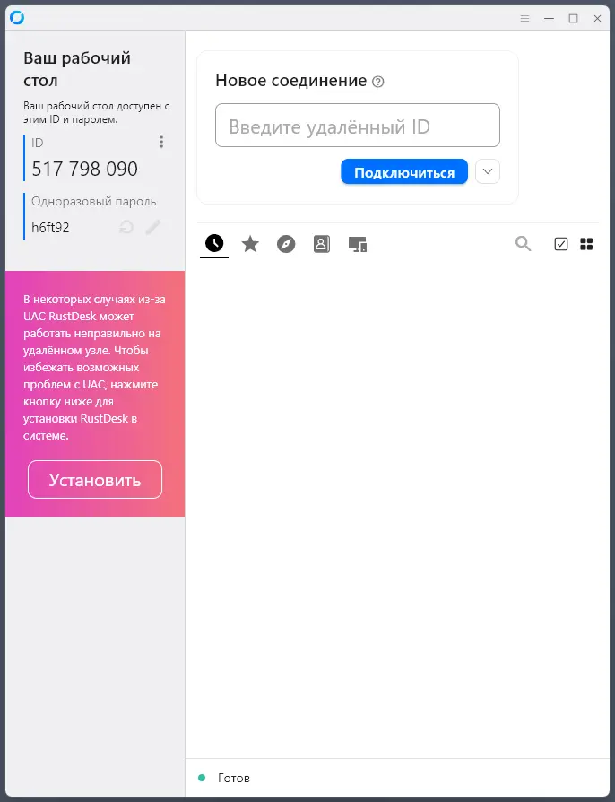
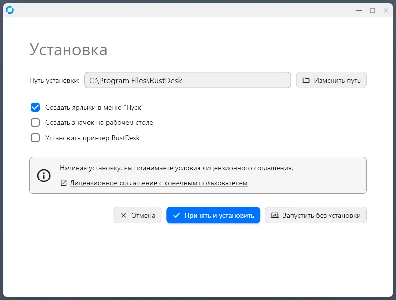
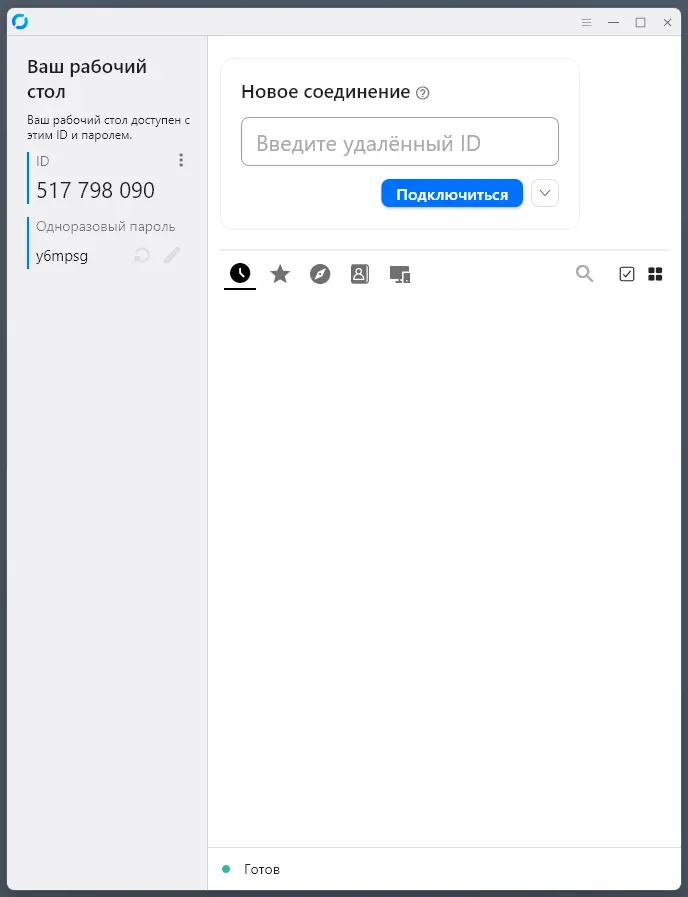
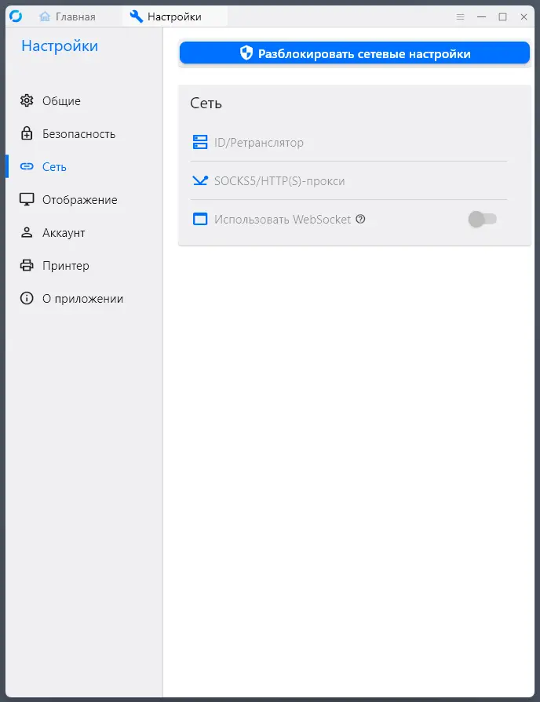
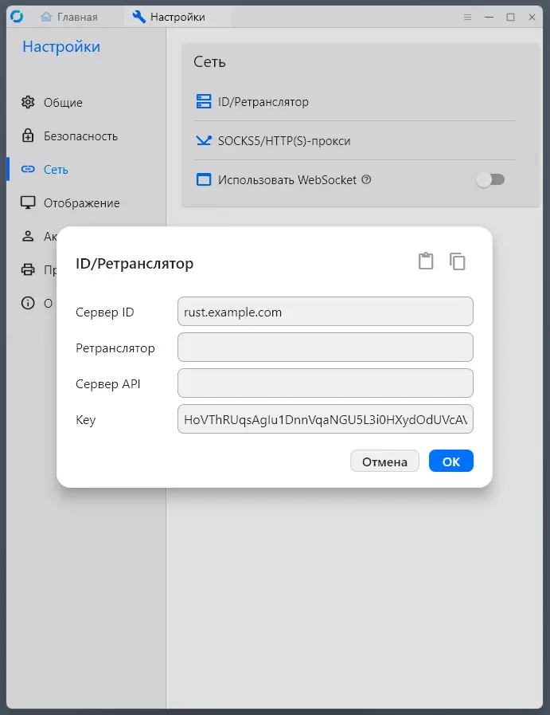
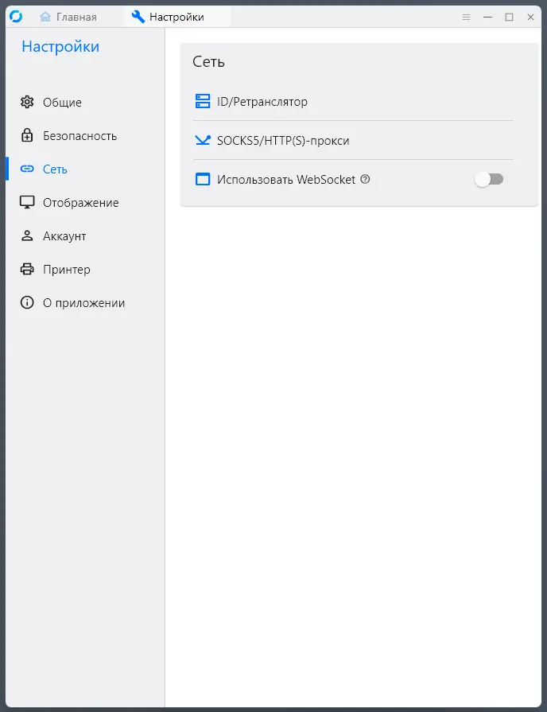
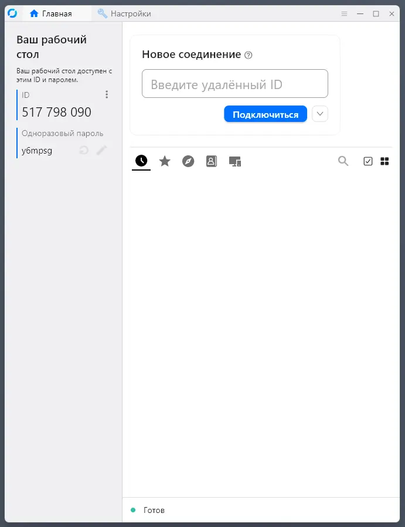

# Установка сервера для удаленного управления клиентами **rustdesk**

[RustDesk](https://rustdesk.com/) - замена TeamViewer, AnyDesk.

Где взять **VDS**-сервер и как его настроить, читать [здесь](https://github.com/margazun/vpn-xray-server)

Будем устанавливать **RustDesk** в docker-контейнерах на сервер Ubuntu 24.04.3 LTS.

## Подготовка к установке

Для своего ip - ```ip addr | grep ens``` создаем у регистратора A-запись вида rust.example.com

На сервере уже установлены и работают:

* Nginx-full
* CertBot
* Docker

Если чего-то нет, устанавливаем.


## Обновление системы

```
sudo apt update && sudo apt upgrade -y
```

## Настройка **NGINX**

* В файл ```/etc/nginx/nginx.conf``` вносим изменения

```
stream {
  map $ssl_preread_server_name $backend {
    rust.example.com         127.0.0.1:8089; // Добавляем строку. Порт 8089 - можно указать любой свободный 
    ...
  }
}
```

* создаем конфиг для Nginx

```
sudo nano /etc/nginx/sites-available/rust.example.com.conf
```

в файл записываем

```
server {
    listen 127.0.0.1:8089 ssl http2;
    
    ssl_certificate /etc/letsencrypt/live/rust.example.com/fullchain.pem;
    ssl_certificate_key /etc/letsencrypt/live/rust.example.com/privkey.pem;
    
    include /etc/letsencrypt/options-ssl-nginx.conf;
    ssl_dhparam /etc/letsencrypt/ssl-dhparams.pem;
    
    server_name rust.example.com;

    location / {
        proxy_pass http://127.0.0.1:21117;
        proxy_http_version 1.1;
        proxy_set_header Upgrade $http_upgrade;
        proxy_set_header Connection "upgrade";
        proxy_set_header Host $host;
        proxy_set_header X-Real-IP $remote_addr;
        proxy_set_header X-Forwarded-For $proxy_add_x_forwarded_for;
    }

}
```

* подключаем конфиг

```
sudo ln -s /etc/nginx/sites-available/rust.example.com /etc/nginx/sites-enabled/
```

* получаем ssl-сертификат для домена

```
certbot certonly --standalone --preferred-challenges http -d rust.example.com
```

если сертификат не выпустят, то ждем, пока не обновятся записи DNS.

* проверяем на отсутствие ошибок и перегружаем **Nginx**

```
sudo nginx -t
```

```
sudo systemctl restart nginx
```
## Настройка Docker-файла

* Создаем папки
```
sudo mkdir -p /opt/rustdesk/data
```

* Создаем docker-файл
```
sudo nano /opt/rustdesk/docker-compose.yml
```
и записываем в него

```
services:
  hbbs:
    image: rustdesk/rustdesk-server:latest
    container_name: rustdesk_hbbs
    command: hbbs
    restart: unless-stopped
    volumes:
      - /opt/rustdesk/data:/root
    depends_on:
      - hbbr
    network_mode: host

  hbbr:
    image: rustdesk/rustdesk-server:latest
    container_name: rustdesk_hbbr
    command: hbbr
    restart: unless-stopped
    volumes:
      - /opt/rustdesk/data:/root
    network_mode: host
```

* запускаем контейнеры
```
cd /opt/rustdesk
```
```
sudo docker compose up -d
```

* проверяем, что контейнеры запустились
```
sudo docker ps -a
```
должны быть запущены контейнеры **hbbs** и **hbbr**
```
CONTAINER ID   IMAGE                             COMMAND    CREATED       STATUS       PORTS   NAMES
c899a5b8f1b1   rustdesk/rustdesk-server:latest   "hbbs"     2 hours ago   Up 2 hours           rustdesk_hbbs
d274051a1cd5   rustdesk/rustdesk-server:latest   "hbbr"     2 hours ago   Up 2 hours           rustdesk_hbbr
...
```

* после успешного запуска контейнеров каталог ```/opt/rustdesk/data/``` должен выглядеть, примерно, так:

```
sudo ls -la /opt/rustdesk/data/
total 156
drwx------ 2 root root  4096 Sep 20 04:51 .
drwxr-xr-x 3 root root  4096 Sep 20 01:22 ..
-rw-r--r-- 1 root root 24576 Sep 20 02:52 db_v2.sqlite3
-rw-r--r-- 1 root root 32768 Sep 20 03:16 db_v2.sqlite3-shm
-rw-r--r-- 1 root root 82432 Sep 20 03:16 db_v2.sqlite3-wal
-rw-r--r-- 1 root root    88 Sep 20 02:52 id_ed25519
-rw-r--r-- 1 root root    44 Sep 20 02:52 id_ed25519.pub

```

**id_ed25519** - приватный ключ сервера

**id_ed25519.pub** - публичный ключ сервера, его содержимое мы скопируем

```
sudo cat /opt/rustdesk/data/id_ed25519.pub
```

и будем использовать для подключения на клиентах.

## Подключение клиентов

* Идем в [репозиторий](https://github.com/rustdesk/rustdesk/releases/latest),
скачиваем клиентов, соответствующих архитектур и запускаем. 

### Настройка клиента на Windows

* Запускаем скачанный клиент


* Нажимаем кнопку "Установить"


* нажимаем кнопку "Принять и установить"



* Нажимаем три точки



* Нажимаем **Сеть**,**Разблокировать сетевые настройки** и **ID/Ретранслятор**



* В поле **Сервер ID** вводим имя нашего домена, в поле **Key** вводим значение публичного ключа, жмем кнопку **OK**



* Нажимаем **Главная**



* Все, настройка клиента закончена. Теперь можно подключаться к другому устройству так же как и в **Anydesk** и **TeamViewer**.

Теперь у вас собственный сервер для удаленного подключения к клиентам.

Смысла описывать подключение клиентов других платформ не вижу - все, примерно, похоже.


